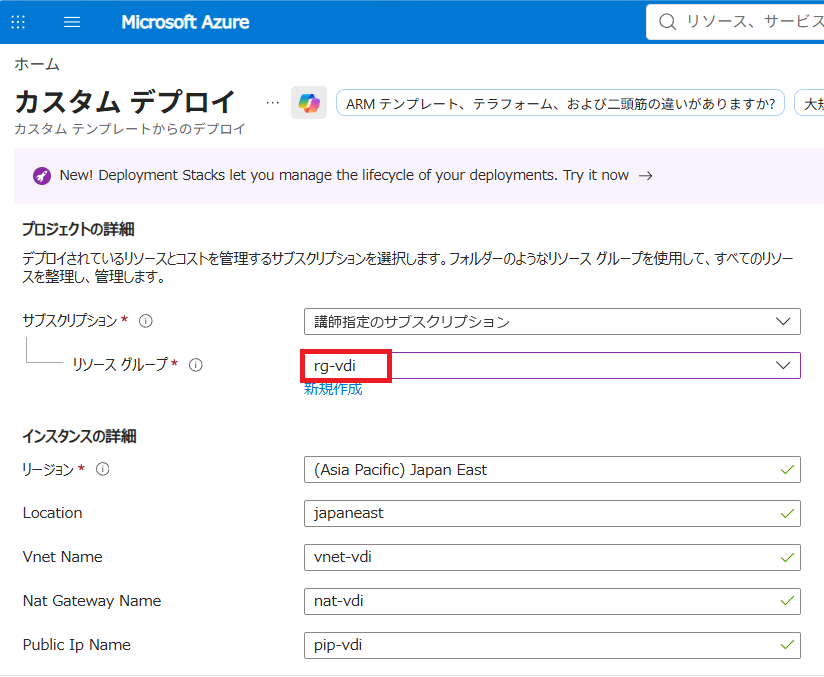
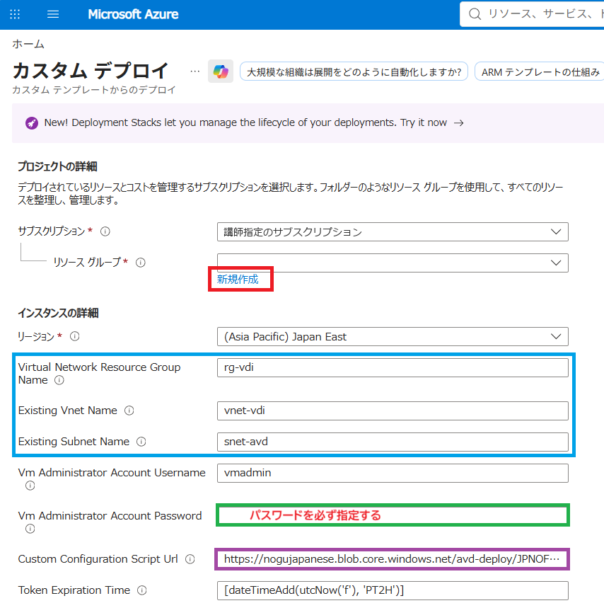
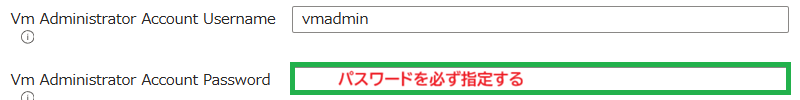

# Day 1：手動準備から Windows 365・AVD の構築へ

> **公開済み・実機リハーサル前の準備版。** [README のデプロイバッジ](README.md)をクリックすると固定コミットのテンプレートで Azure portal が開きます。匿名取得と SHA-256 は確認済みですが、実際の Azure デプロイ・SSO 接続は未確認です。[残項目](revision-list.md)の実機確認が済むまで受講者に［作成］を実行させません。掲載画像は記事・旧資料の参考で、今回のテンプレートの実行結果ではありません。

## 今回の進み方

**前提確認・RG 設定【手動】 → Network【Deploy to Azure】 → Windows 365【担当パート】 → AVD・接続権限・SSO【Deploy to Azure】**

受講者は PowerShell、Azure CLI、Bicep のコマンドを実行しません。リソースグループは IaC 実行前に手動で作成・確認します。

| パート | 次へ進むための条件 |
| --- | --- |
| 手動準備 | 指定テナント・サブスクリプション、`rg-vdi`、権限、講師の SSO 準備を確認 |
| Network | 成功後に VNet・3サブネット・NAT の関連付けを確認 |
| Windows 365 | 担当者が区切りまでの完了と AVD への移行を案内 |
| AVD | リソース・接続権限・SSO 設定に加え、登録・拡張機能・実接続を確認 |

処理時間は保証しません。VM、ディスク、NAT Gateway、Public IP 等には料金が発生し、ブラウザーを閉じても削除されません。

## 1. 前提確認・リソースグループの設定【手動】

### 1.1 講師・管理者の事前準備

| 項目 | 準備・確認すること |
| --- | --- |
| 対象環境 | テナントとサブスクリプションを個別案内。実 ID を公開資料に記載しない |
| 演習の分離 | 名前が固定のため同一サブスクリプションでは同じ環境になる。個別演習は別サブスクリプション、または配布前に講師が構成を変更 |
| 利用者・ライセンス | 対象テナントのメンバーアカウント、AVD と Windows 365 の利用資格 |
| Azure の権限 | RG 作成権限、リソース作成権限、DAG と VM に必要な RBAC を割り当てる権限。Contributor のみでは不足 |
| プロバイダー | `Microsoft.Network`、`Microsoft.Compute`、`Microsoft.DesktopVirtualization` の登録 |
| SKU・イメージ | Japan East の `Standard_D4as_v6`、vCPU クォータ、Office 入り Windows 11 25H2 イメージ、Trusted Launch の利用可否 |
| 通信・制約 | AVD、Entra ID、更新、構成パッケージ等への外向き通信。Azure Policy、Conditional Access／MFA |
| SSO のテナント設定 | Windows Cloud Login の RDP 認証有効化。以下の講師準備を実施 |
| 運用 | Windows 365 側の準備、Day 2 保持、停止・削除日、残存費用 |

SSO 準備は Microsoft Entra 管理センターの［デバイス］→［リモート接続構成］→［Windows Cloud Login］で行います。Application Administrator／Cloud Application Administrator 等の必要な Entra 権限を持つ講師・管理者が RDP 認証を有効化し、適用される認証・MFA・Conditional Access を確認します。**本 ARM はこのテナント設定を変更しません。**

[Microsoft の SSO 設定手順](https://learn.microsoft.com/azure/virtual-desktop/configure-single-sign-on)を参照します。受講者へのサブスクリプション全体の Owner 一律付与や、Conditional Access の無効化を前提にしません。

### 1.2 受講者：対象環境を確認

1. [Azure portal](https://portal.azure.com/) に講師指定のメンバーアカウントでサインインします。このアカウントで後の AVD デプロイと接続も行います。
2. ディレクトリ切り替えで対象テナントを選び、名前・ID を個別案内と照合します。
3. ［サブスクリプション］で対象の名前・ID を照合します。別テナント・業務用の環境へ実行しません。
4. 講師とリソース作成・ロール割り当て権限、SSO の事前準備を確認します。

### 1.3 受講者：記事と同じ RG を手動設定

1. ［リソース グループ］→［作成］を開きます。講師が事前作成した場合は指定 RG を開きます。
2. 指定サブスクリプション、名前 **`rg-vdi`**、リージョン **Japan East** を選びます。
3. 記事に合わせ必須タグは設けません。既存 Bicep 版の `training`／`participant` タグや削除スクリプトは使用しません。
4. ［確認および作成］で確認後に作成し、RG の［概要］と［アクセス制御（IAM）］で対象と必要権限を確認します。

RG 新規作成画面は実機リハーサルで撮影予定です。旧タグ画面は[流用一覧](reuse-inventory.md)に保管していますが、この手順の必須設定ではありません。

**完了条件：** 指定環境に `rg-vdi` が存在し、Japan East と権限を確認済みであること。ボタンの実行先 RG は portal で選ぶため、**テンプレートが RG 選択の誤りを自動修正・防止するものではありません。**

## 2. VNet 等の共通基盤を構築する【Deploy to Azure】

### 2.1 Network ボタンと固定構成

[README の Network ボタン欄](README.md#2-network-を-deploy-to-azure)を使用します。記事の旧外部テンプレートではなく、同梱 [network.json](templates/network.json) の固定コミット版を参照します。クリックで Azure portal が開くこと、JSON の匿名取得・ハッシュ一致を確認済みです。実際の Azure 作成は未リハーサルです。

*旧画面の参考です。新版では VNet 名・アドレス等のテンプレート入力欄を固定化しており、この画像の入力欄は表示されません。サブスクリプション表示は加工済みです。*

| 対象 | 固定値 |
| --- | --- |
| リージョン／VNet | `japaneast`／`vnet-vdi`、`10.10.0.0/16` |
| Cloud PC 用サブネット | `snet-cloudpc`、`10.10.1.0/24` |
| Server 用サブネット | `snet-server`、`10.10.2.0/24` |
| AVD 用サブネット | `snet-avd`、`10.10.3.0/24` |
| NAT／Public IP | `nat-vdi`／`pip-vdi`、Standard・静的 IPv4、NAT のタイムアウト4分 |
| 送信設定 | 3サブネットに NAT を関連付け、`defaultOutboundAccess: false` |
| NSG | 記事同様に作成しない。受信・東西通信の制御は配布前に確認 |

### 2.2 公開・リハーサル完了後の操作

1. Network ボタンで［カスタム デプロイ］を開き、講師が承認したテンプレートであることを確認します。
2. 手順1と同じサブスクリプションと **既存 `rg-vdi`** を選びます。新規 RG は作成しません。
3. テンプレート固有のパラメーター入力がないこと、［テンプレートの編集］等で固定構成が指定値と一致することを確認します。テンプレートを編集・保存して変更はしません。
4. ［確認および作成］で検証結果を確認し、講師の案内に従って［作成］します。
5. RG の［デプロイ］で成功を確認します。`vnet-vdi` の［サブネット］で3つの範囲と `nat-vdi` の関連付けを確認します。

NAT の Public IP は VM への受信用ではありません。Server 用の VM、Cloud PC、ANC はこのテンプレートでは作成しません。旧 Bicep の2サブネット構成を重ねて実行しません。

**完了条件：** 3サブネットと明示的な送信経路が存在し、Windows 365 担当者へネットワーク情報を渡せること。

## 3. Windows 365 を構築する【担当パート】

ここから Windows 365 担当者の資料へ切り替えます。**構築手順・ANC・ライセンス・ポリシーの準備は担当側に任せ、本資料では代わりに実装しません。**

| 受け渡す情報 | 内容 |
| --- | --- |
| 環境 | 指定テナント・サブスクリプション、`rg-vdi`／Japan East |
| ネットワーク | `vnet-vdi` と `snet-cloudpc` の実リソース ID、名前、アドレス |
| 制御・状態 | NAT 関連付け、明示的送信、NSG なし、Network の成功 |
| 運用 | 保持・削除予定、課題、AVD へ戻るタイミング |

実 ID やアカウント情報は個別の運営連絡で共有します。ANC 方式か Microsoft ホスト型ネットワークか、共通 VNet を使うか、必要な通信・権限は担当者と配布前に照合します。

担当者が区切りまでの完了と AVD へ進んでよいことを案内します。**Windows 365 後に Network を再実行しません。** 再適用が必要な場合は講師がサブネット・ANC への影響を確認します。

## 4. AVD を構築する【Deploy to Azure】

### 4.1 AVD ボタンと入力

[README の AVD ボタン欄](README.md#4-avd-を-deploy-to-azure)を使用します。使用するのは同梱 [avd.json](templates/avd.json) の固定コミット版で、旧記事の汎用テンプレートとは異なります。クリックで Azure portal が開く URL とテンプレートの匿名取得を確認済みですが、Azure デプロイ・SSO 接続は未リハーサルです。

*旧画像の［新規作成］は使用せず、既存 `rg-vdi` を選びます。画像に多数の入力欄がありますが、新版のテンプレート入力欄はパスワード1つだけです。*

既存ネットワークは **`rg-vdi`／`vnet-vdi`／`snet-avd`** に固定され、受講者は入力しません。AVD は Network・Cloud PC・ANC を作成・再適用しません。

入力項目は **Vm Administrator Account Password** のみです。ローカル管理者名は `vmadmin` です。

> **入力前に必ず確認：12～123文字が必須です。** 11文字以下では `InvalidTemplate`（パラメーターの長さ不足）となり、デプロイを開始できません。入力ミス防止のため14文字以上を推奨します。英大文字・英小文字・数字・記号のうち3種類以上を使い、Azure VM のパスワード要件を満たしてください。

研修専用のローカル管理者パスワードを使い、テナントのサインイン用パスワードとは分けます。ファイル・チャット・スクリーンショットに保存しません。

### 4.2 自動で作られるもの

| 対象 | 固定設定・自動処理 |
| --- | --- |
| ホストプール | `DefaultHostPool`、Pooled／Standard／BreadthFirst、最大5セッション |
| DAG／Workspace | `DefaultHostPool-DAG`／`AVD Session Host`、Workspace へ DAG 登録 |
| VM | `avd-0`、1台、`Standard_D4as_v6`、128 GiB `StandardSSD_LRS` |
| OS | `microsoftwindowsdesktop`／`office-365`／`win11-25h2-avd-m365`／`latest` |
| ID・保護 | Entra ID 参加、システム割り当て ID、Intune なし、Trusted Launch／Secure Boot／vTPM |
| 接続権限 | 実行したユーザーへ DAG の Desktop Virtualization User と VM の Virtual Machine User Login |
| SSO | ホストプールへ `enablerdsaadauth:i:1` を設定 |
| 登録 | Entra ID 参加 → DSC による AVD 登録。登録トークンは2時間、保護設定にのみ格納 |
| 日本語設定等 | 登録後に記事の `JPNOFLNG.ps1` を実行。Windows Update・自動再起動を含む |

VM 名は記事の日時式から固定 `avd-0` に変更しています。イメージの `latest` と外部スクリプトは可変で、同じテンプレートでも取得内容が変わる可能性があります。サイズ・イメージの利用可否と、スクリプトの再起動・拡張機能結果は配布前の実機確認が必要です。

AVD の日本語設定拡張機能は公開 Blob のスクリプトを `ExecutionPolicy Bypass` で実行し、スクリプト内でバージョン未固定の `PSWindowsUpdate` を導入します。Deploy to Azure の固定コミットはこの外部スクリプトを固定しません。**悪意あるコードの追加・スクリプトの不審な差し替え・未承認の変更の配布や実行は禁止です。** 講師が配信元と実行内容を確認できない場合はデプロイせず、詳細は [README のセキュリティ注意](README.md)を確認してください。この注意書き自体はコード改変や供給元の変更を防止しません。

**本人がデプロイして本人が接続**します。Object ID は `deployer().objectId` で取得し、2種類のロールをリソース単位で付与します。サービスプリンシパル・グループは対象外です。講師が別アカウントで再実行すると、その講師にも権限が追加されるため代行前に確認します。

### 4.3 検証・作成・状態確認

1. 同じアカウント、サブスクリプション、既存 **`rg-vdi`** を選び、パスワードだけ入力します。
2. ［確認および作成］で検証結果を確認します。エラー時は実行せず、講師と原因を確認します。受講者判断でリージョン・サイズ・ネットワークを変更しません。
3. ［作成］後、RG の［デプロイ］で結果を確認します。失敗を成功と扱わず、デプロイ名・失敗リソース・エラーを講師に共有します。秘密を共有しません。
4. VM の［拡張機能とアプリケーション］で Entra ID 参加・DSC・Custom Script の成功を確認します。自動再起動の途中では接続確認に進みません。
5. ホストプールの［セッション ホスト］で `avd-0` の登録と `Available` を確認します。NIC に Public IP がないことを確認します。
6. DAG の［割り当て］と［アクセス制御（IAM）］で自分の Desktop Virtualization User、VM の［アクセス制御（IAM）］で Virtual Machine User Login を確認します。
7. ホストプールの［RDP プロパティ］で SSO 設定を確認します。テナント側の Windows Cloud Login 準備は講師に確認します。

登録・拡張機能の失敗や RBAC の不足があれば停止し、講師へ引き継ぎます。AVD の復旧時に Network を再実行・削除しません。固定名への再実行は既存 VM やパスワードを変更し得るため、講師の確認なく行いません。

### 4.4 Windows App から SSO 接続確認

1. Windows App に**デプロイと同じメンバーアカウント**でサインインします。
2. `AVD Session Host` のデスクトップを確認します。表示されない場合は同じユーザー・テナント、DAG 登録、割り当てと反映状況を講師と確認します。
3. デスクトップを開き、組織の認証・MFA・同意画面が出る場合は講師の案内に従います。VM ローカル管理者のパスワードを接続用として入力しません。
4. デスクトップが利用できることを確認します。認証ループや資格情報入力が想定と異なる場合は、Windows Cloud Login、RDP プロパティ、RBAC、接続端末・クライアントの SSO 要件、Conditional Access を確認します。

**完了条件：** AVD デプロイ、セッションホスト・拡張機能、両ロール、ホストプール SSO とテナント準備を確認し、Windows App で実接続できること。ARM の成功だけで SSO 成功と判定しません。実接続は現時点では未確認です。

## Day 1 の終了時：保持・停止・削除

講師の保持・停止指示に従います。Day 2 で使用する場合は削除しません。VM の割り当て解除後も NAT Gateway、Public IP、ディスク等の費用は残ります。

削除を指示された場合は対象テナント・サブスクリプション・`rg-vdi` の全リソースと Windows 365／ANC への影響を講師・担当者が確認します。**Windows 365 の担当者の了承なく RG 全体を削除しません。** Entra デバイス、ANC 等の残存処理を含む本番の削除手順は配布前の残作業です。旧 Bicep 版の削除スクリプトは名前・タグが異なるため流用しません。
